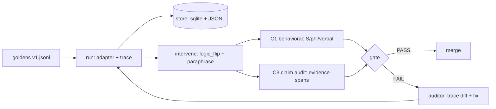

# CFA-mesh

Agents write long reasoning traces that look right while the answer comes from somewhere else. CFA-mesh catches that. It saves the full trace, flips one step, reruns it, and checks if the answer moves. If the answer stays put after the logic changed, the trace was decoration — the gate fails and points at the exact span.

M1 is small on purpose: pytest over 20 goldens, two perturbations (`logic_flip` + `paraphrase`), cosine check, claim-to-evidence links. Runs on `qwen2.5-coder:1.5b` or `gemma2:2b` locally, or the same small models through Groq with a key. No big models, no remote calls by default.

Use it as a merge gate: green means the reasoning held up, red means fix the prompt or the tool wiring and rerun.

## Pipeline



M2 adds tiering + cache + budgets. M3 adds all 6 interventions + NLI scoring. M4 adds WARN/BLOCK + replay + export. M5 adds second harness + evidence bank + retention + RBAC.

## Setup

```bash
git clone https://github.com/Bappaditya-kuilya/CFA-mesh.git
cd CFA-mesh
cp cfa.example.yaml cfa.yaml
```

Pick a model in `cfa.yaml`. Local needs nothing else. Groq needs one env var:

```bash
export GROQ_API_KEY="gsk-..."
```

No pip packages needed for M1 — stdlib only. M3+ optionally uses a local NLI model.

## How to use it

Run the gate:

```bash
python3 -c "import tests.test_faithfulness as t; t.test_m1_gate(); print('M1 gate PASS')"
```

Run with options:

```bash
CFA_TASKS=evals/goldens/v1.jsonl CFA_LIMIT=20 python3 -c "import tests.test_faithfulness as t; t.test_m1_gate()"
```

With pytest installed:

```bash
pytest --run-eval --limit 20
```

Write the HTML report:

```bash
python3 report.py
```

A FAIL names the task, the flipped branch, and the missing `evidence_span_id`. Open the trace, fix the prompt or tool wiring, rerun until green.

See `prd.md` for the full spec, thresholds, and security notes.
